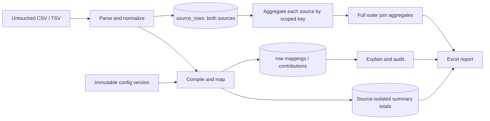

# Architecture

## Chosen shape

A modular Go CLI, one PostgreSQL database, local immutable input files, and generated XLSX artifacts. Start with Go 1.27.1 and PostgreSQL 18.6, verified available in official documentation on 2026-09-10. Pin the tested patch versions and container digests during implementation. Use pgx/v5, Excelize/v2 and the standard library; pin exact library versions in go.mod/go.sum after checking their current Go requirements. No ORM is needed for the small, explicit SQL model.

The mapping engine is pure Go. Database adapters persist immutable results. Reconciliation SQL operates on source rows and stored mapping keys; summary SQL operates on contributions. Reporting receives read models and never assigns accounting buckets.

## Package ownership

| Package | Responsibility | Must not do |
| --- | --- | --- |
| `cmd/recon` | Parse flags, signal cancellation, exit status | Calculate finance totals |
| `internal/money` | Parse AUD decimals, checked cents arithmetic, formatting | Guess locale or round input |
| `internal/ingest` | CSV/TSV parsers, header detection, source locations | Clean files externally |
| `internal/normalize` | Versioned label aliases, dates, canonical fields | Choose summary buckets |
| `internal/mapping` | Compile configs, select rules, key expansion, route | SQL or Excel I/O |
| `internal/domain` | Small shared types and status definitions | Framework abstractions |
| `internal/store` | pgx transactions, COPY, queries, migrations | Infer mapping defects |
| `internal/reconcile` | Group/read models and coverage checks | Pair raw row cross-products |
| `internal/report` | Workbook rendering and artifact checks | Reclassify amounts |
| `internal/app` | Orchestrate complete runs and replay | Hide failed validations |
| `migrations` | Versioned DDL and seed definitions | Load corrected configs as originals |
| `testdata` | Small synthetic fixtures and frozen expected results | Leak raw customer data in CI |

Use interfaces only at actual boundaries (reader, run store, report writer). Pass context explicitly. Prefer small value types and table-driven functions to inheritance-like layers or a general rules DSL.

## Processing sequence

1. Validate file paths and sizes; compute SHA-256 while reading immutable bytes. Validate original input/config hashes against the manifest for the reference-data acceptance run.
2. Import mapping CSV rows verbatim as an original config version, preserving file hash and physical line. Compile supported templates and retain diagnostics. Freeze the version.
3. Create a run identity from ordered source hashes, config content hash, normalization version, layout version, selected settlement/currency and engine version. Claim it with a unique database constraint.
4. Parse all input rows and metadata, map each row, and insert both sources in the shared table. Retain per-rule decisions and nonzero contributions. Accumulate summary totals by source and scope during this pass.
5. In the same data transaction verify row counts, amount parsing, key consistency, mapping coverage, and summary conservation as applicable to baseline/fixed mode; finish ingestion atomically.
6. Build grouped keys and full-outer-join read models inside a transaction. Persist group membership to make report audit navigation stable.
7. Read the immutable completed run, write a temporary XLSX in the destination directory, close and verify it, then atomically rename. Register its checksum in the database after rename.
8. On fixed runs perform exact summary and per-key acceptance controls. Publish a failed verification status and diagnostics if any check fails; never label the report final merely because writing succeeded.

## Transactions and crash behavior

Use a small run-claim transaction first. Use one ingestion data transaction for the supplied roughly 20 MB of text input. Bounded COPY batches and PostgreSQL-backed aggregation avoid retaining all rows in memory. Failure rolls back all run data and records the failure in a separate status transaction. Do not leave a partial run eligible for reconciliation/reporting.

A unique run fingerprint prevents duplicate ingestion. Claim with `INSERT ... ON CONFLICT`; a concurrent caller observes the existing run and either returns its completed identity or reports `RUN_IN_PROGRESS`. It must not start another importer. Do not silently reclaim a crashed run: `retry --run` takes a database row lock, requires a terminal failure or explicitly recorded interruption, increments attempt, and clears only uncommitted/failed derived data for that run. Completed runs remain immutable.

File-system writes cannot share a PostgreSQL transaction. Report retry is safe because the database run is immutable; detect an already complete artifact by its run identity and checksum. If rename succeeds but artifact registration fails, retry validates and registers the file. If writing fails, remove only the temporary file. Do not overwrite before-fix output with after-fix output.

## Performance budget

Engineering target, not a measured claim: reference dataset completes in under two minutes on a documented 4-core/8-GB development machine; Go process peak RSS under 512 MB. Profile each stage, report actual hardware and numbers. Stream parsers and large worksheets; group through SQL with indexes. Do not parallelize accounting mutation until profiling justifies it. Optimize with evidence without changing ordering, lineage, or transaction semantics.
